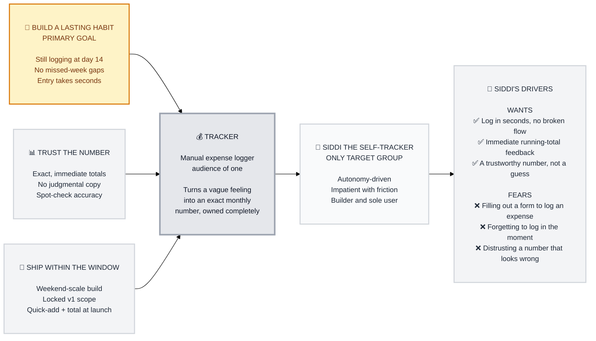

# Trigger Map: Tracker

> Connects business goals to user psychology — the strategic North Star for all Tracker design decisions.

**Document:** Trigger Map - Hub
**Created:** 2026-07-02
**Status:** COMPLETE

---

## How to Read This Map

Tracker is a genuine audience-of-one product — one person builds it, one person uses it, forever. That collapses the usual multi-persona Trigger Map into a single, deep psychological profile. Read this as: **3 business goals → 1 product → 1 user → that user's driving forces**, all pointing at the same behavioral bet: *will removing setup and logging friction actually keep him tracking past day 14?*

---

## The Transformation

Tracker turns "I probably spend too much on X" — a vague, unconfirmed feeling — into a specific, trustworthy monthly number per category, with logging that takes only a few seconds and never requires more than an amount and a category tap.

---

## Visual Map

---

## Business Strategy

- **Primary Goal — Build a lasting personal logging habit:** the actual behavioral bet this launch tests. Success = still logging at day 14.
- **Prerequisite — Trust the number:** the habit only survives if Siddi believes what he sees. Exact, immediate, non-judgmental totals.
- **Prerequisite — Ship within the window:** gates whether the other two goals ever get tested. A weekend-scale build with a locked scope.

See [01-Business-Goals.md](01-Business-Goals.md) for full objectives.

---

## The Only Target Group

**Siddi the Self-Tracker** — solo founder, sole user, autonomy-driven, impatient with friction, has a quiet personal stake in shipping this solo. This is deliberately the only persona: the Product Brief states audience-of-one as a strategic choice, not a gap to fill with invented users.

See [02-Siddi-the-Self-Tracker.md](02-Siddi-the-Self-Tracker.md) for the full psychological profile and driving forces.

---

## Strategic Implications

1. **Speed of logging and absence of form-like friction are the highest-scored forces (15/15 each)** — the quick-add box's single-tap category design is already pointed at the right target.
2. **Fear of forgetting (14/15) is the named core abandonment risk** — v1's always-visible quick-add mitigates it but doesn't fully solve it; worth watching post-launch.
3. **Trust in the number matters as much as speed** — every entry must reflect exactly and immediately, with zero judgmental copy, or the habit collapses even if logging itself is fast.

Full scoring: [06-Feature-Impact.md](06-Feature-Impact.md). Full strategic synthesis: [05-Key-Insights.md](05-Key-Insights.md).

---

## Related Documents

- **[01-Business-Goals.md](01-Business-Goals.md)** — Vision and SMART objectives
- **[02-Siddi-the-Self-Tracker.md](02-Siddi-the-Self-Tracker.md)** — The only persona, in full psychological depth
- **[05-Key-Insights.md](05-Key-Insights.md)** — Strategic implications for design
- **[06-Feature-Impact.md](06-Feature-Impact.md)** — Driving force scoring and prioritization
