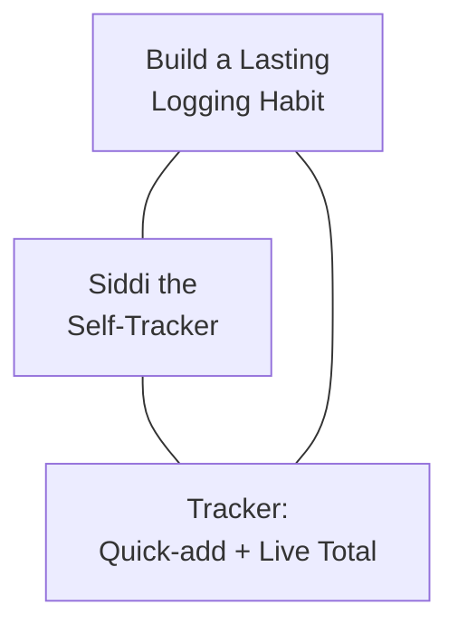

# Siddi the Self-Tracker

> The only target group for Tracker — deliberately singular, by design.

**Document:** Trigger Map - Primary (and Only) Persona
**Created:** 2026-07-02
**Status:** COMPLETE
**Priority:** 1 (Only Target Group)

---

## Profile Summary

Siddi is the founder, sole stakeholder, and sole user of Tracker — the creator and the customer are the same person. He's building a manual expense logger because he wants a specific, trustworthy monthly number to replace a vague, nagging sense that he's overspending somewhere. He's not shopping for a tracking app; he's building the one he wants, on his own terms, in a self-imposed short window.

---

## Who Siddi Is

Solo founder and first-time solo product builder. Spends mostly digitally (card/UPI) — his transactions are technically reconstructable after the fact, but he chooses manual entry deliberately, for ownership, not because he lacks an alternative. There is no consistent tracking today, just an unconfirmed feeling that spending in some category is higher than it should be.

---

## Current Situation

Today, Siddi has no reliable answer to "how much did I actually spend on X this month?" He's ruled out automation-heavy trackers (Walnut, ETMoney) because they demand bank-linking and broad permissions he doesn't trust, and he's ruled out existing manual-entry apps (Monefy, Goodbudget, Pocket Clear) and spreadsheets because none of them are genuinely *his* — they're someone else's roadmap, not built to fit exactly how he wants to log spending.

---

## Psychological Profile

Siddi is driven by **autonomy and ownership** — he's building this specifically because he wants a tool that's his, not adopted from someone else's product decisions. He's **pragmatic and impatient with friction**: anything that costs more than a couple of seconds to log an expense is a tax he won't keep paying, and he knows it. He doesn't need gamification, streaks, or encouragement copy — for a tool only he will ever see, performed enthusiasm feels hollow rather than motivating.

There's also a **quiet personal stake** at play: shipping this, solo, start to finish, inside a self-imposed short window, matters independently of whether the app impresses anyone. Because he is both builder and user, his **ownership is absolute** — there's no team to hand off to and no external deadline forcing follow-through, which is a source of pride but also the one real risk to the project ever existing.

---

## Internal State

When Siddi thinks about his spending today, he feels a **low-grade, background unease** — not panic, just an itch of "I probably spend too much on X" that he currently has no way to confirm or dismiss. When he thinks about the act of logging an expense, he wants **zero friction and zero judgment**: a number he doesn't trust, or a UI that so much as hints at scolding him, are equally likely to make him quietly stop opening the app.

---

## Usage Context

**1. Access/Discovery:** Opens the app directly — bookmarked or pinned. No discovery step, no search, no marketing funnel; he is both the builder and the only visitor.

**2. Emotional State:** Two distinct modes: (a) rushed and mid-task when logging an expense in passing, (b) reflective and unhurried during the roughly-monthly total review.

**3. Behavior Pattern:** Logging is tap-amount, tap-category, done — no reading, no deciding. The monthly review is a quick scan of category totals, not a deep-dive session.

**4. Decision Criteria:** Does logging cost him basically zero attention? Does the running total feel exact and trustworthy the instant he glances at it?

**5. Success Outcome:** An expense gets logged in a few seconds without breaking whatever he was doing before opening the app; at month-end, the category totals hand him a specific number in place of the vague feeling he started with.

---

## Driving Forces

### Wants (✅)

**1. Log an expense in seconds without breaking flow**
*Tracker Promise:* The quick-add box is always visible on the home screen — enter an amount, tap a category, done. No navigation, no multi-step form.

**2. See the running total update immediately after each entry**
*Tracker Promise:* The current-month total updates the instant an entry is saved — no refresh, no delay, no separate "view report" step.

**3. Get a specific, trustworthy number that replaces the vague feeling**
*Tracker Promise:* Every entry rolls up into an exact per-category monthly total, replacing guesswork with a number he can check anytime.

### Fears (❌)

**1. Logging that feels like filling out a form**
*Tracker Answer:* No mandatory fields beyond amount and category — nothing else to fill in, nothing else to decide.

**2. Forgetting to log in the moment**
*Tracker Answer:* The quick-add box lives on the home screen, so logging never requires hunting for the right place — it's the first thing he sees.

**3. Distrusting a number that looks wrong**
*Tracker Answer:* The total is a direct, exact sum of what he entered — no estimates, no rounding, no hidden logic to second-guess.

*(Two additional, lower-scored forces — wanting full ownership to evolve the tool, and the satisfaction of shipping solo — are documented in [06-Feature-Impact.md](06-Feature-Impact.md) but fall outside the top 3 per side.)*

---

## Transformation Journey

**Before:** A vague, unconfirmed feeling — "I probably spend too much on X" — with mental estimation as the only tool, breaking down as spending grows and diversifies.

**Through Tracker:** Fast, frictionless logging in the moment, with an always-visible running total providing immediate feedback after every entry.

**After:** A specific, trustworthy monthly number per category, checked in on roughly monthly — a confirmed fact instead of a nagging feeling.

---

## Strategic Triangle

The business goal, the persona, and the product are the same closed loop: Siddi's own behavior is simultaneously the goal, the user, and the test of whether the product works.

---

## Role

Siddi is not a customer to be won over — he is the founder, the builder, and the sole judge of whether Tracker succeeds. His role in the Trigger Map is unusual only in that it collapses the normal builder/user distinction entirely.

---

## Relationship to Business Goals

- ✅ **Build a Lasting Personal Logging Habit:** Siddi's own day-14 continued use *is* this goal — there is no other user whose behavior could satisfy it.
- ✅ **Trust the Number:** His own monthly spot-check against the running total is the sole validation loop for this goal.
- ✅ **Ship v1 Within the Self-Imposed Window:** His own discipline and scope adherence are the only mechanism that could hit or miss this goal — no team, no external deadline.

---

## Related Documents

- **[00-trigger-map.md](00-trigger-map.md)** — Visual overview and navigation
- **[01-Business-Goals.md](01-Business-Goals.md)** — Objectives and metrics
- **[05-Key-Insights.md](05-Key-Insights.md)** — Strategic implications
- **[06-Feature-Impact.md](06-Feature-Impact.md)** — Full driving force scoring

---

_Back to [Trigger Map](00-trigger-map.md)_
