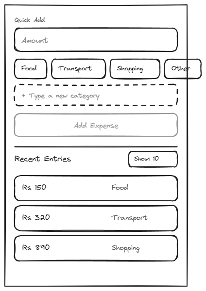

# 1.1-home

## Page Metadata

| Property | Value |
|----------|-------|
| **Scenario** | 01-siddi-logs-an-expense |
| **Page Number** | 1.1 |
| **Platform** | Mobile (desktop equally supported) |

## Overview

**Page Purpose:** See the always-visible quick-add box, ready to log an expense with zero navigation.

**Entry Context:** Siddi opens the bookmarked/pinned app directly on his phone right after paying for something — no search, no menu, no funnel.

**Exit Action:** Enters an amount, taps a category, then taps "Add Expense" to move to entry submission (1.2 confirm popup).

**On-Page Interactions:**
- Adding a custom category — simple text field, alongside the fixed category buttons
- Selecting how many recent entries are displayed in the list below the quick-add box

**User Situation (Q3):** Siddi the Self-Tracker — just paid for something (coffee, cab, groceries), a few seconds before moving on to whatever he was doing.

**Mental State (Q4):**
- Hope: The expense is logged before he forgets, gone in a couple of taps.
- Worry: He gets distracted before finishing and it silently never gets logged.

**Discovery Method (Q6):** Opens the bookmarked/pinned app directly on his phone right after paying for something.

---

## Design Dialog Findings

**Primary Action (D1):** Enter an amount and tap a category button to log a new expense entry. Categories are a fixed preset set, plus an "add new category" option via a simple text field for categories not covered by the presets.

**Amendment (during specification):** An explicit **"Add Expense" button** was added below the category row — disabled until both amount and category are filled, then tapping it opens the 1.2 confirm popup. This closes a gap between the 1.1 wireframe (originally no submit trigger) and the 1.2 decision to keep category-selection and submission as separate, explicit actions ("keep it separate to avoid confusion").

**Simplification (D2):** Amount and category stay as two separate fields/taps — no further simplification. This page has no navigation, no menu, no funnel — it IS the entry point.

**Content Needs:**
- Quick-add box: amount field + fixed category buttons + custom-category text field (inline/expandable) + "Add Expense" button
- Recent entries list below the quick-add box, showing amount + category per entry
- Control for the user to select how many recent entries are displayed
- **No running month total on this page** — the current-month total is reserved for the Monthly Category Breakdown page (scenario 02) only, not shown here

**Driving Forces Addressed:**
- ✅ Hope: two-field quick-add (amount + category, one tap each) keeps logging to a couple of taps
- ⏸️ Worry (gets distracted before finishing, entry silently never saved): explicitly deferred for v1 — no partial-input persistence if Siddi navigates away mid-entry. Flagged as a v2+ candidate, not designed now.

**Complexity Notes:**
- Custom-category entry needs an interaction model (inline expand vs. "Other" button revealing a text field) — to define during specification
- Recent-entries count selector is a small on-page control — exact UI (stepper, dropdown) to define during specification
- Infinite scroll on the recent entries list is explicitly out of scope for v1 (later version)
- Platform is mobile-first with desktop equally supported — responsive layout decisions needed after the base (mobile) spec is complete

---

## Visual Reference



**Wireframe:** `Sketches/1.1-home-wireframe.excalidraw` (editable source) — approved 2026-07-02

**Layout (mobile, 375×580):**
- Quick Add box: amount field, 4 fixed category buttons (Food / Transport / Shopping / Other), dashed "+ Type a new category" field, "Add Expense" button (disabled until valid)
- Recent Entries: section header + "Show: 10" count control, sample rows showing amount + category
- No running month total on this page (reserved for Monthly Category Breakdown, scenario 02)

---

## Layout Structure

```
+-------------------------------+
| Quick Add                     |
|  [ Amount.................  ] |
|  [Food] [Transport] [Shopping]|
|  [Other]                      |
|  [ + Type a new category    ] |
|  [       Add Expense        ] |
+-------------------------------+
| Recent Entries       Show: 10 |
|  [ Rs 150      Food         ] |
|  [ Rs 320      Transport    ] |
|  [ Rs 890      Shopping     ] |
+-------------------------------+
```

---

## Responsive Diff — Desktop (`bp-desktop`, 900px reference)

No new content or interactions — same `home-quickadd` and `home-recent` sections, laid out side by side instead of stacked, since desktop width is otherwise wasted on a single narrow column.

```
+---------------------------------------------------------+
| Quick Add                | Recent Entries      Show: 10 |
|  [ Amount.............. ]|  [ Rs 150      Food         ]|
|  [Food][Transport][Shop.]|  [ Rs 320      Transport    ]|
|  [Other]                 |  [ Rs 890      Shopping     ]|
|  [ + Type a new category]|                               |
|  [      Add Expense     ]|                               |
+---------------------------------------------------------+
```

| Property | Mobile | Desktop |
|----------|--------|---------|
| Layout | Single column, stacked | Two columns: Quick Add (left, fixed ~400px) / Recent Entries (right, fills remainder) |
| Page padding | `space-md` | `space-xl` |
| Column gap | n/a | `space-xl` |
| Category buttons | Wrap to 2 rows (Food/Transport/Shopping, then Other) | Single row, all 4 fit |

All Object IDs, behaviors, and validation are unchanged from the mobile spec above — this is a layout-only diff.

---

## Spacing

**Scale:** [Spacing Scale](../../../D-Design-System/00-design-system.md#spacing-scale)

| Property | Token |
|----------|-------|
| Page padding (horizontal) | space-md |
| Section gap (Quick Add → Recent Entries) | space-xl |
| Element gap within Quick Add (amount → categories → custom field → button) | space-sm |
| Category buttons gap (horizontal) | space-xs |
| Recent entry row gap | space-xs |

---

## Typography

**Scale:** [Type Scale](../../../D-Design-System/00-design-system.md#type-scale)

| Element | Semantic | Size | Weight | Typeface |
|---------|----------|------|--------|----------|
| "Quick Add" label | p | text-sm | medium | default, muted color |
| Amount input value/placeholder | p | text-md | normal | default |
| Category button label | p | text-sm | medium | default |
| "Add Expense" button label | p | text-md | semibold | default |
| "Recent Entries" heading | H2 | text-lg | semibold | default |
| Count selector label | p | text-sm | normal | default |
| Entry row amount | p | text-md | normal | default |
| Entry row category | p | text-sm | normal | default, muted color |

---

## Page Sections

### Section: Quick Add

**OBJECT ID:** `home-quickadd`

| Property | Value |
|----------|-------|
| Purpose | Primary logging entry point — amount + category + submit |
| Component | Card/Container |
| Padding | space-md |
| Element gap | space-sm |

---

#### Amount Input

**OBJECT ID:** `home-quickadd-amount-input`

| Property | Value |
|----------|-------|
| Component | Text Input (numeric keyboard on mobile) |
| Translation Key | `home.quickadd.amount.placeholder` |
| EN | "Amount" |
| Behavior | onChange updates amount value; must be > 0 to enable submit |

#### Category Buttons — Food / Transport / Shopping / Other

**OBJECT ID:** `home-quickadd-category-{food\|transport\|shopping\|other}`

| Property | Value |
|----------|-------|
| Component | Button (single-select toggle) |
| EN | "Food" / "Transport" / "Shopping" / "Other" |
| Behavior | onClick selects this category, deselecting any other preset or the custom field |

#### ↕ `home-quickadd-h-space-xs` — gap between category buttons

#### Custom Category Input

**OBJECT ID:** `home-quickadd-category-custom-input`

| Property | Value |
|----------|-------|
| Component | Text Input (dashed border, expandable) |
| Translation Key | `home.quickadd.category.custom.placeholder` |
| EN | "+ Type a new category" |
| Behavior | Typing here sets the category to this custom value and deselects any preset button. On submit, matched case-insensitively against existing categories (presets + previously used custom ones) — a match reuses the existing category rather than creating a duplicate. No cap on the number of distinct custom categories for v1. |

#### Add Expense Button

**OBJECT ID:** `home-quickadd-submit`

| Property | Value |
|----------|-------|
| Component | Button Primary |
| Translation Key | `home.quickadd.submit.label` |
| EN | "Add Expense" |
| Behavior | Disabled until amount > 0 AND a category (preset or custom) is set. onClick opens the 1.2 confirm popup. |

---

### Section: Recent Entries

**OBJECT ID:** `home-recent`

| Property | Value |
|----------|-------|
| Purpose | Shows logged entries — supports correction, gives immediate visual proof the entry registered |
| Component | List container |
| Padding | space-md |
| Element gap | space-xs |

---

#### Recent Entries Heading

**OBJECT ID:** `home-recent-heading`

| Property | Value |
|----------|-------|
| Component | H2 heading |
| Translation Key | `home.recent.heading` |
| EN | "Recent Entries" |

#### Entry Count Selector

**OBJECT ID:** `home-recent-count-selector`

| Property | Value |
|----------|-------|
| Component | Dropdown |
| EN options | "5" / "10" / "20" |
| Behavior | onChange limits the number of rows shown. Default: "10" |

#### Entry Row (repeating)

**OBJECT ID:** `home-recent-entry-row`

| Property | Value |
|----------|-------|
| Component | List item, tappable |
| Content | `{amount}` · `{category}` |
| Behavior | onClick opens the existing edit/delete interaction (per Phase 3 scope) |

---

## Page States

| State | When | Appearance | Actions |
|-------|------|------------|---------|
| Default | Entries exist for the current month | Quick Add + populated Recent Entries list | Log new entry; tap an entry to edit/delete |
| Loading | Initial page load, entries fetching | Quick Add usable immediately; Recent Entries area shows skeleton rows | None until loaded |
| Empty | No entries logged yet this month | Recent Entries area replaced with "No entries yet this month" | Log first entry via Quick Add |
| Error | Recent Entries fail to load | Quick Add still usable; Recent Entries area shows inline error + Retry | Retry |

---

## Technical Notes

- "Add Expense" disabled state is pure client-side validation (amount > 0 AND category set) — no network call until Confirm on 1.2.
- Quick Add stays usable even if the Recent Entries list fails to load — logging should never be blocked by a display-only list failing.
- Custom category matching is case-insensitive string comparison against the full category list (presets + all previously used custom values) at submit time.

---

## Open Questions

| # | Question | Context | Status |
|---|----------|---------|--------|
| 1 | Desktop layout for 1.1 not yet explored | Platform is "mobile, desktop equally supported" but base spec only covers mobile | 🟢 Resolved — see Responsive Diff below |
| 2 | Duplicate custom category handling | If Siddi types a category name matching an existing one (case-insensitive?), should it merge or create a duplicate? | 🟢 Resolved: case-insensitive match merges into the existing category, no duplicate created |
| 3 | Max custom categories | Cap, or unlimited? | 🟢 Resolved: no cap for v1 — audience of one, unlikely to spiral; revisit if it becomes messy |

---

## Checklist

- [x] Page purpose clear
- [x] All Object IDs assigned
- [x] Components reference design system (Quick Add and Recent Entries are page-specific containers, not cross-page shared components — no extraction needed. Design System reviewed 2026-07-03 during `[M]` extraction pass.)
- [x] Translations complete (EN only — single product language)
- [x] States documented
- [x] Conditional sections included where needed (form validation applies — see Technical Notes)
