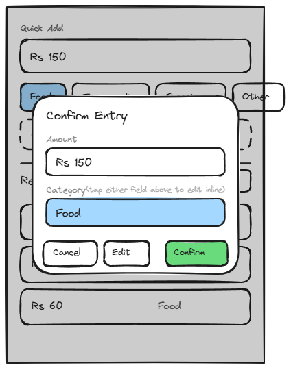

# 1.2-home

## Page Metadata

| Property | Value |
|----------|-------|
| **Scenario** | 01-siddi-logs-an-expense |
| **Page Number** | 1.2 |
| **Platform** | Mobile (desktop equally supported) |

## Overview

**Page Purpose:** Submit the entered amount and category, converting the quick-add into a saved entry.

**Entry Context:** Arrived from 1.1-home — Siddi entered an amount, tapped a category, then tapped "Add Expense" to open this popup.

**Exit Action:** Taps "Confirm" to save the entry, moving to 1.3-home.

**On-Page Interactions:**
- Confirm popup: Confirm ("Add") and Cancel actions
- Tap-to-edit-inline (within the popup): tap the Amount or Category field to adjust it inline, without closing the popup

---

## Design Dialog Findings

**Primary Action (D1):** Tap "Add" to confirm and submit the entry — but first, a popup opens showing a summary of the entry (amount + category) with Confirm, Cancel, and Edit actions.

**Simplification (D2):** Considered removing the confirm step entirely (auto-submit on category tap, relying on the existing edit/delete interaction on Home to fix mistakes after the fact) — trigger map speed-of-logging scores highest (15/15) and the scenario's own framing favors "easy to fix" over "get it right first time." **Decision: keep the confirm popup anyway** — a deliberate tradeoff of a small amount of speed for in-the-moment accuracy confidence, made knowingly rather than by default.

**Content Needs:**
- Popup/modal overlay showing entry summary: amount + category
- Three actions in the popup: **Confirm** (saves and proceeds to 1.3), **Cancel** (discards, returns to 1.1), **Edit** (adjusts amount/category inline within the same popup, without closing it)

**Driving Forces Addressed:**
- ✅ Trust: confirm-before-save catches mis-taps before they're committed — directly addresses Q1's "trusting it's easy to fix if something gets mis-tapped," but preemptively rather than only after the fact
- ⚖️ Speed tradeoff acknowledged and accepted: this popup costs a small amount of the "gone in a couple of taps" hope in exchange for accuracy confidence — a considered decision, not an oversight

**Complexity Notes:**
- Popup/modal is a new UI pattern for this scenario — first use, candidate for a shared Design System component if reused elsewhere
- Inline edit inside the popup means the amount field and category selector need to be interactive within the modal (a compact version of the 1.1 quick-add controls), not just static summary text
- **Open question for specification stage:** does Cancel discard the entry and return to the empty 1.1 idle state, or return to 1.1 with the amount/category still filled (not yet cleared)? **Resolved below in Page Sections (Cancel Button).**

---

## Visual Reference



**Wireframe:** `Sketches/1.2-home-wireframe.excalidraw` (editable source) — approved 2026-07-02

**Layout (mobile, 375×520):** Base Home screen (same as 1.1) shown underneath a scrim, with the amount field filled ("Rs 150") and "Food" category shown selected. A centered "Confirm Entry" popup card shows:
- Amount row (tappable to edit inline, pencil icon)
- Category row (tappable to edit inline, pencil icon)
- Action row: Cancel / Confirm (Confirm visually distinct as the primary action)

*Note: wireframe PNG predates the Edit-button-removal resolution above — regenerate before handoff if a pixel-accurate reference is needed; the spec text is authoritative.*

---

## Layout Structure

```
+-------------------------------+
|  (dimmed Home screen behind)  |
|   +-----------------------+   |
|   |  Confirm Entry        |   |
|   |  Amount (tap to edit) |   |
|   |  [ Rs 150           ✎]|   |
|   |  Category (tap to edit)|  |
|   |  [ Food             ✎]|   |
|   |                       |   |
|   |      [Cancel][Confirm]|   |
|   +-----------------------+   |
+-------------------------------+
```

---

## Responsive Diff — Desktop (`bp-desktop`, 900px reference)

No layout change — the confirm popup is already a centered, fixed-width modal (max ~360px) over a dimmed background. On desktop it sits centered over the [1.1 two-column layout](../1.1-home/1.1-home.md#responsive-diff--desktop-bp-desktop-900px-reference) instead of the mobile single column, but the modal itself, its Object IDs, and its behavior are unchanged.

---

## Spacing

**Scale:** [Spacing Scale](../../../D-Design-System/00-design-system.md#spacing-scale)

| Property | Token |
|----------|-------|
| Popup padding | space-lg |
| Element gap within popup | space-md |
| Action button row gap | space-sm |

---

## Typography

**Scale:** [Type Scale](../../../D-Design-System/00-design-system.md#type-scale)

| Element | Semantic | Size | Weight | Typeface |
|---------|----------|------|--------|----------|
| "Confirm Entry" title | H2 | text-lg | semibold | default |
| Field label ("Amount"/"Category") | p | text-xs | normal | default, muted color |
| Field value | p | text-md | normal | default |
| Cancel / Edit button label | p | text-sm | medium | default |
| Confirm button label | p | text-sm | semibold | default |

---

## Page Sections

### Section: Confirm Popup

**OBJECT ID:** `home-confirm-popup`

| Property | Value |
|----------|-------|
| Purpose | Pre-save review of the entry before committing |
| Component | [Overlay — Centered Dialog variant](../../../D-Design-System/00-design-system.md#overlay) |
| Padding | space-lg |
| Element gap | space-md |

---

#### Popup Title

**OBJECT ID:** `home-confirm-title`

| Property | Value |
|----------|-------|
| Component | H2 heading |
| Translation Key | `home.confirm.title` |
| EN | "Confirm Entry" |

#### Amount Field

**OBJECT ID:** `home-confirm-amount`

| Property | Value |
|----------|-------|
| Component | Editable field (tap to edit inline), pencil icon affixed to signal it's tappable |
| Translation Key | `home.confirm.amount.label` |
| EN (label) | "Amount" |
| Content | `{amount}` — e.g. "Rs 150" |
| Behavior | Tap anywhere on the field enters inline edit mode; same validation as `home-quickadd-amount-input` |

#### Category Field

**OBJECT ID:** `home-confirm-category`

| Property | Value |
|----------|-------|
| Component | Editable field (tap to edit inline — reuses the category selector), pencil icon affixed to signal it's tappable |
| Translation Key | `home.confirm.category.label` |
| EN (label) | "Category" |
| Content | `{category}` |
| Behavior | Tap anywhere on the field opens the same preset/custom category selector as `home-quickadd-category-*` |

#### Cancel Button

**OBJECT ID:** `home-confirm-cancel`

| Property | Value |
|----------|-------|
| Component | Button Secondary |
| EN | "Cancel" |
| Behavior | Closes the popup and returns to 1.1 **with the amount/category still filled** (not cleared). *Resolves the open question flagged during discussion: Siddi tapped "Add Expense" on purpose, so Cancel most likely means "let me adjust something," not "start over" — clearing the fields would undo work he already did.* |

#### Confirm Button

**OBJECT ID:** `home-confirm-submit`

| Property | Value |
|----------|-------|
| Component | Button Primary |
| EN | "Confirm" |
| Behavior | Saves the entry (waits for save confirmation — see Technical Notes), closes the popup, transitions to 1.3 |

**Resolved (previously flagged):** the standalone Edit button was cut — it was a second affordance doing exactly what tap-to-edit-inline already does. Discoverability is instead handled by a pencil icon on the Amount/Category fields, avoiding a duplicate action while keeping the fields' tappability obvious.

---

## Page States

| State | When | Appearance | Actions |
|-------|------|------------|---------|
| Default | Popup just opened, valid amount/category | Amount + Category shown, Confirm enabled | Confirm / Cancel / tap-to-edit either field |
| Editing | Amount or Category field tapped | Field becomes an active input inline | Save inline edit (implicit on blur/selection) |
| Saving | Confirm tapped, waiting for save | Confirm button's label is replaced by an inline spinner (no separate overlay); other actions disabled | None until save resolves |
| Error | Save fails (e.g., network) | Inline error message in the popup; entry data preserved | Retry (re-tap Confirm) |

---

## Technical Notes

- **Save is pessimistic, not optimistic:** given "trust the number" is the whole point of this project, the popup waits for a confirmed save before transitioning to 1.3 — no showing success before it's actually saved.
- Inline edit fields reuse the same input/selector components as 1.1's Quick Add (`home-quickadd-amount-input`, `home-quickadd-category-*` patterns) rather than being separate components.

---

## Open Questions

| # | Question | Context | Status |
|---|----------|---------|--------|
| 1 | Cancel behavior | Return to 1.1 with fields still filled | 🟢 Resolved: fields stay filled, not cleared |
| 2 | Edit button vs. inline tap-to-edit redundancy | Both do the same thing — intentional for discoverability, or should Edit be cut? | 🟢 Resolved: Edit button cut; pencil icon on the fields handles discoverability instead |
| 3 | Exact appearance of the Saving state | Spinner replacing Confirm's label, or a separate loading overlay? | 🟢 Resolved: inline spinner replaces the Confirm label, no separate overlay |

---

## Checklist

- [x] Page purpose clear
- [x] All Object IDs assigned
- [x] Components reference design system — `home-confirm-popup` uses the [Overlay — Centered Dialog variant](../../../D-Design-System/00-design-system.md#overlay)
- [x] Translations complete (EN only)
- [x] States documented
- [x] Conditional sections included where needed (form validation applies to inline edit fields)
