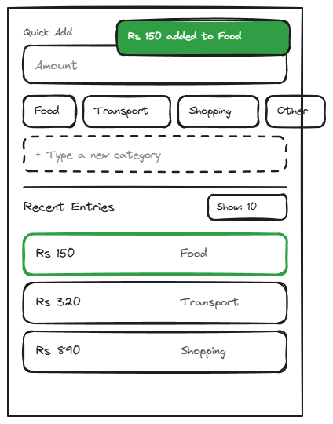

# 1.3-home

## Page Metadata

| Property | Value |
|----------|-------|
| **Scenario** | 01-siddi-logs-an-expense |
| **Page Number** | 1.3 |
| **Platform** | Mobile (desktop equally supported) |

## Overview

**Page Purpose:** Confirm the log succeeded — a toast confirms the save and the new entry appears at the top of the Recent Entries list. *(Revised in Phase 4: the "current-month total updates" part of the original purpose no longer applies — the running total was moved to the Monthly Breakdown page (scenario 02) only, decided during 1.1 discussion. A toast replaces the total as the confirmation signal.)*

**Entry Context:** Arrived from 1.2-home — Siddi tapped "Confirm" to save the entry.

**Exit Action:** Final — scenario success ✓ (no further navigation required; Siddi returns to whatever he was doing before opening the app)

**On-Page Interactions:**
- Tapping an existing entry in the list lets Siddi correct the amount/category or delete it (addresses the "distrusting a number that looks wrong" fear) — in scope per project decision, documented here as an on-page interaction rather than a new scenario step.
- Empty state ("No entries yet this month") shown when no entries exist yet for the current month.

---

## Design Dialog Findings

**Primary Action (D1):** No primary user action — this is the resting/confirmation state after save. A toast confirms the entry was added; the new entry appears at the top of the Recent Entries list; the quick-add fields reset (amount cleared, category deselected) ready for the next log.

**Simplification (D2):** Confirmed this page is effectively "1.1's idle state + a toast" rather than a distinct screen to design from scratch — the quick-add box and Recent Entries list layout are already established from 1.1. Only the toast itself is new.

**Content Needs:**
- Toast: **"₹150 added to Food"** pattern (amount + category), positioned top-right, auto-dismisses after a couple of seconds
- New entry appears at the top of the Recent Entries list
- Quick-add fields reset to empty/idle state (matches 1.1)

**Driving Forces Addressed:**
- ✅ Hope: toast + list update give immediate, visible confirmation that the entry registered — replaces the total-update signal originally planned here (total is now Monthly Breakdown-only)

**Complexity Notes:**
- Toast is a new UI pattern for this scenario — candidate for a shared Design System component (also useful for future confirmations elsewhere)
- No new wireframe needed beyond adding the toast to the existing 1.1 layout (see Visual Reference)

---

## Visual Reference



**Wireframe:** `Sketches/1.3-home-wireframe.excalidraw` (editable source) — approved 2026-07-02

**Layout (mobile, 375×520):** Same idle Home layout as 1.1 (quick-add fields reset/empty), with:
- Toast, top-right: "Rs 150 added to Food" (green, auto-dismisses after a couple of seconds)
- Recent Entries list: the new entry now at the top, outlined to distinguish it as just-added

---

## Layout Structure

Reuses `home-quickadd` and `home-recent` sections exactly as defined in [1.1-home](../1.1-home/1.1-home.md#page-sections), reset to idle values, plus one new element:

```
+-------------------------------+
|                   [ Toast   ] |
| Quick Add (reset to idle)     |
|  ...                          |
+-------------------------------+
| Recent Entries       Show: 10 |
|  [ Rs 150      Food    ] NEW  |
|  [ Rs 320      Transport    ] |
|  [ Rs 890      Shopping     ] |
+-------------------------------+
```

---

## Responsive Diff — Desktop (`bp-desktop`, 900px reference)

Reuses [1.1's desktop two-column layout](../1.1-home/1.1-home.md#responsive-diff--desktop-bp-desktop-900px-reference) exactly (Quick Add left, Recent Entries right), with the toast anchored top-right of the whole page — not scoped to either column — same as the mobile toast's top-right anchor, just relative to the wider viewport.

---

## Spacing

**Scale:** [Spacing Scale](../../../D-Design-System/00-design-system.md#spacing-scale)

| Property | Token |
|----------|-------|
| Toast padding | space-sm space-md |
| Toast offset from screen edge | space-md |

---

## Typography

**Scale:** [Type Scale](../../../D-Design-System/00-design-system.md#type-scale)

| Element | Semantic | Size | Weight | Typeface |
|---------|----------|------|--------|----------|
| Toast message | p | text-sm | medium | default, on dark/success background |

---

## Page Sections

### Section: Toast

**OBJECT ID:** `home-toast`

| Property | Value |
|----------|-------|
| Purpose | Confirms the save succeeded — the primary "it registered" signal now that the total no longer lives here |
| Component | Toast notification, top-right |
| Padding | space-sm space-md |

#### Toast Message

**OBJECT ID:** `home-toast-message`

| Property | Value |
|----------|-------|
| Component | Toast text |
| Translation Key | `home.toast.entryAdded` |
| EN | "{amount} added to {category}" — e.g. "Rs 150 added to Food" |
| Behavior | Appears on successful save; auto-dismisses after ~2.5 seconds, at which point the new-entry row highlight fades simultaneously (single timer, no separate coordination). If a second entry is saved while a toast is still showing, toasts **stack** vertically (most recent on top), each dismissing independently on its own timer — handles a quick multi-item logging burst without losing confirmations. Does not block interaction with the page underneath. |

All other content on this page reuses `home-quickadd-*` (reset to empty/idle) and `home-recent-*` Object IDs from [1.1-home](../1.1-home/1.1-home.md#page-sections) — no new sections beyond the toast.

---

## Page States

| State | When | Appearance | Actions |
|-------|------|------------|---------|
| Default | Toast visible | Toast shown top-right, new entry highlighted at top of list | Toast auto-dismisses; entry becomes a normal row after dismiss |
| Stacked | A new entry is saved while a prior toast is still showing | Toasts stack vertically top-right, most recent on top; each corresponding entry highlighted in the list | Each toast auto-dismisses independently on its own timer |
| Settled | All toasts have dismissed | Identical to 1.1's Default state | Log next entry; tap an entry to edit/delete |

---

## Technical Notes

- The "new entry" visual distinction (outlined row) is purely transient — it fades to a normal row on the same ~2.5s timer as its toast (see Toast Message behavior), not a separately tracked duration.
- Toast stacking requires each toast to carry its own dismiss timer and reference its own entry's row-highlight — no shared/global timer.

---

## Open Questions

| # | Question | Context | Status |
|---|----------|---------|--------|
| 1 | Toast dismiss vs. "new entry" row highlight timing | Should they dismiss together, or does the row stay highlighted slightly longer? | 🟢 Resolved: dismiss together on one ~2.5s timer |
| 2 | Multiple rapid entries | If Siddi logs two entries within a couple of seconds, do toasts stack, replace, or queue? | 🟢 Resolved: stack vertically, most recent on top, each dismissing independently |

---

## Checklist

- [x] Page purpose clear
- [x] All Object IDs assigned (new: toast; reused: quick-add, recent entries from 1.1)
- [ ] Components reference design system — toast is a single-use pattern, tracked as a candidate in [`D-Design-System/00-design-system.md` → Patterns](../../../D-Design-System/00-design-system.md#toast-notification). Not a defect: per project convention, patterns extract to formal Components on their 2nd use, not the 1st. Revisit if a second toast use appears.
- [x] Translations complete (EN only)
- [x] States documented
- [x] Conditional sections included where needed
