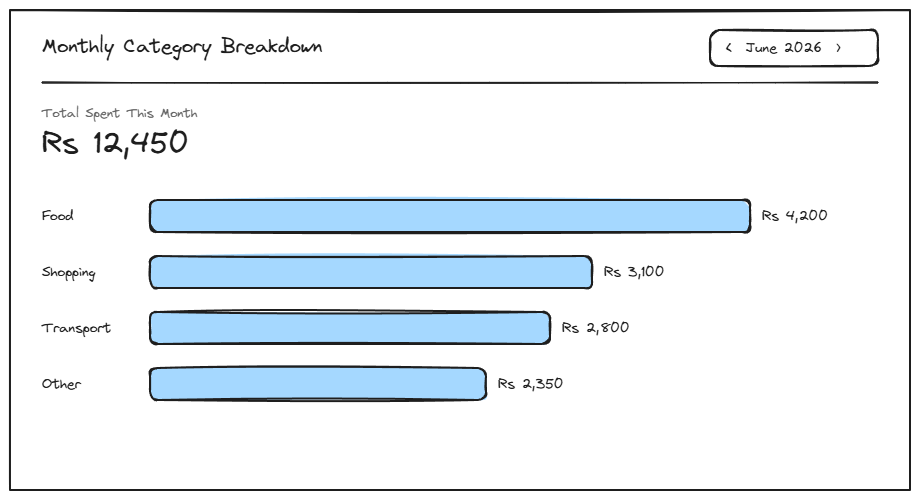

# 2.1-monthly-breakdown

## Page Metadata

| Property | Value |
|----------|-------|
| **Scenario** | 02-siddi-reviews-the-month |
| **Page Number** | 2.1 |
| **Platform** | Desktop or mobile — equal priority |

## Overview

**Page Purpose:** See this month's per-category totals at a glance.

**Entry Context:** Siddi opens the bookmarked app during an unhurried moment near month-end, specifically to check spending rather than to log anything new.

**Exit Action:** Scans the totals and decides to spot-check one category against memory, moving to 2.2-monthly-breakdown.

**On-Page Interactions:**
- Month selector (dropdown/arrows near the top) — lets Siddi browse past months, not just the current one. Defaults to the current month.

---

## Design Dialog Findings

**Primary Action (D1):** Scan this month's per-category totals at a glance.

**Simplification (D2):** Not simplified — expanded in scope. Browsing past months (not just current-month-only) is part of the core page, not a v2 addition, since reviewing trends over time supports the "trust the number" goal just as much as the current month does.

**Content Needs:**
- **Overall month total** — the running total moved here from Home (Scenario 01 decision) lives at the top of this page as the headline number
- **Per-category totals as bars/chart** — not a plain list; visual bars make "at a glance" comparison actually work
- **Month selector** — dropdown or arrows near the top, defaults to the current month

**Driving Forces Addressed:**
- ✅ Hope: bar/chart visualization + headline total give a specific, comparable number instead of a vague feeling
- ➡️ Worry ("total looks off, is it a bug?"): verification is NOT handled here — deliberately deferred to step 2.2 (spot-check), which is exactly the step designed to resolve this fear

**Complexity Notes:**
- Bar/chart component is a new UI pattern for this project — candidate design system component
- Month selector needs an empty-state definition for months with no entries — to define during specification
- Desktop/mobile have equal priority for this page (unlike Scenario 01's mobile-first) — responsive layout for the chart needs real design attention, not just a diff

---

## Visual Reference



**Wireframe:** `Sketches/2.1-monthly-breakdown-wireframe.excalidraw` (editable source) — approved 2026-07-02
**Base viewport:** Desktop (900×480) — mobile explored as a responsive diff afterward, per equal-priority Q5

**Layout:**
- Header: "Monthly Category Breakdown" title + month selector ("‹ June 2026 ›") top-right, defaults to current month
- "Total Spent This Month" headline number below the divider
- Horizontal bar chart, one row per category, sorted largest to smallest, amount labeled at the end of each bar

**User Situation (Q3):** Siddi the Self-Tracker — near month-end, unhurried, sitting down specifically to check in on where his money went.

**Mental State (Q4):**
- Hope: The category totals finally give him a specific number instead of a vague feeling of overspending.
- Worry: A total looks off and he can't tell if it's a bug or he really spent that much.

**Discovery Method (Q6):** Opens the bookmarked app during an unhurried moment near month-end, specifically to check spending.

---

## Layout Structure

Desktop (900px base):

```
+---------------------------------------------------------+
| Monthly Category Breakdown   + Log an expense  [‹ June 2026 ›] |
+---------------------------------------------------------+
| Total Spent This Month                                  |
| Rs 12,450                                                |
|                                                           |
| Food       [==================================] Rs 4,200 |
| Shopping   [==========================]         Rs 3,100 |
| Transport  [========================]           Rs 2,800 |
| Other      [====================]               Rs 2,350 |
+---------------------------------------------------------+
```

---

## Responsive Diff — Mobile (`bp-mobile`, 375px reference)

Same sections, stacked into a single column with a narrower chart. Bar labels move above each bar (instead of alongside) so bar width isn't squeezed by long category names at narrow width.

```
+-------------------------------+
| Monthly Category Breakdown    |
| + Log an expense               |
| [ ‹ June 2026 › ]              |
+-------------------------------+
| Total Spent This Month        |
| Rs 12,450                     |
+-------------------------------+
| Food                  Rs 4,200|
| [============================]|
| Shopping               Rs 3,100|
| [======================]      |
| Transport              Rs 2,800|
| [====================]        |
| Other                  Rs 2,350|
| [=================]           |
+-------------------------------+
```

| Property | Desktop | Mobile |
|----------|---------|--------|
| Layout | Header row (title, home link, and month selector inline) | Header stacked: title, then home link, then month selector |
| Page padding | `space-xl` | `space-md` |
| Bar row | Label left of bar, amount at bar end (single row) | Label + amount above bar (two rows per category) |
| Bar row gap | `space-lg` | `space-md` |

All Object IDs, behaviors, and data (including the data-driven month-selector range and empty-month state) are unchanged from the desktop spec above.

---

## Spacing

**Scale:** [Spacing Scale](../../../D-Design-System/00-design-system.md#spacing-scale)

| Property | Token |
|----------|-------|
| Page padding (horizontal) | space-xl desktop / space-md mobile |
| Header to divider gap | space-lg |
| Divider to total block gap | space-md |
| Total block to chart gap | space-xl |
| Bar row gap | space-lg |

---

## Typography

**Scale:** [Type Scale](../../../D-Design-System/00-design-system.md#type-scale)

| Element | Semantic | Size | Weight | Typeface |
|---------|----------|------|--------|----------|
| Page title | H1 | text-xl | semibold | default |
| Home link | p (link) | text-sm | normal | default, muted color |
| Month selector label | p | text-sm | medium | default |
| "Total Spent This Month" label | p | text-sm | normal | default, muted color |
| Total amount | p | text-3xl | bold | default |
| Category name (bar label) | p | text-sm | medium | default |
| Bar amount label | p | text-sm | normal | default |

---

## Page Sections

### Section: Header

**OBJECT ID:** `breakdown-header`

| Property | Value |
|----------|-------|
| Purpose | Page identity + month navigation |
| Component | Header row |
| Padding | space-lg space-xl |
| Element gap | default |

#### Page Title

**OBJECT ID:** `breakdown-header-title`

| Property | Value |
|----------|-------|
| Component | H1 heading |
| Translation Key | `breakdown.header.title` |
| EN | "Monthly Category Breakdown" |

#### Month Selector

**OBJECT ID:** `breakdown-header-month-selector`

| Property | Value |
|----------|-------|
| Component | Button group (‹ prev / label / next ›) |
| Content | `{month} {year}` — e.g. "June 2026" |
| Behavior | Prev/next arrows step one month at a time; defaults to the current month on page load. Prev arrow disables once the earliest month with any recorded data is reached — no arbitrary fixed lookback limit. Next arrow disables at the current month (no browsing into the future). |

#### Home Link

**OBJECT ID:** `breakdown-header-home-link`

| Property | Value |
|----------|-------|
| Purpose | One-directional nav affordance back to Home, so Siddi can log an expense after reviewing without re-navigating by URL/bookmark. Home itself stays link-free (FR-9's wall-free/no-menu-funnel design is not reopened by this). |
| Component | Plain text link — no button chrome, no icon (no icon library exists in the design system yet; not worth introducing for one link) |
| Translation Key | `breakdown.header.homeLink` |
| EN | "+ Log an expense" |
| Typography | `text-sm`, muted/secondary color — deliberately subdued so it doesn't compete with the title or the total/chart below, consistent with the plain/neutral tone NFR (not styled as a celebratory CTA) |
| Behavior | Navigates to Home (`/`) |

---

### Section: Total Summary

**OBJECT ID:** `breakdown-total`

| Property | Value |
|----------|-------|
| Purpose | Headline number — the running total moved here from Home |
| Component | Stat block |
| Padding | space-md space-xl |

#### Total Label

**OBJECT ID:** `breakdown-total-label`

| Property | Value |
|----------|-------|
| Component | p |
| Translation Key | `breakdown.total.label` |
| EN | "Total Spent This Month" |

#### Total Amount

**OBJECT ID:** `breakdown-total-amount`

| Property | Value |
|----------|-------|
| Component | Stat number |
| Content | `{totalAmount}` — e.g. "Rs 12,450" |

---

### Section: Category Bar Chart

**OBJECT ID:** `breakdown-chart`

| Property | Value |
|----------|-------|
| Purpose | Per-category totals, sorted largest to smallest, for at-a-glance comparison |
| Component | Horizontal bar chart |
| Padding | space-md space-xl |
| Element gap (between bar rows) | space-lg |

#### Category Bar Row (repeating)

**OBJECT ID:** `breakdown-chart-row`

| Property | Value |
|----------|-------|
| Component | Bar chart row (label + bar + amount) — rendered as a semantic `<button>`, not a `<div>` with a click handler |
| Content | `{category}`, bar width proportional to `{amount}` relative to the largest category, `{amount}` label |
| Behavior | Click, or keyboard Enter/Space when focused, opens the 2.2 drill-down panel for that category. Natively reachable via Tab (no explicit `tabindex` needed) and gets standard focus styling for free — matches the `<button>` pattern already used correctly for 1.1's category buttons. |

---

## Page States

| State | When | Appearance | Actions |
|-------|------|------------|---------|
| Default | Selected month has entries | Total + bar chart populated | Switch month, click a category bar |
| Loading | Month data fetching (initial load or after month switch) | Total + chart area show skeleton | None until loaded |
| Empty | Selected month has zero entries | Chart area replaced with centered text "No entries for {month} {year}" (e.g. "No entries for May 2026") — no CTA, since logging happens on Home, not here | Switch to a different month |
| Error | Data fails to load | Inline error + Retry, month selector still usable | Retry, switch month |

---

## Technical Notes

- Bar widths are relative to the largest category **within the selected month**, not a fixed absolute scale — re-normalizes every time the month changes.
- Month selector range is data-driven: bounded by the earliest month with any recorded entry through the current month — no separately configured limit to maintain.
- **Keyboard accessibility (formalized from DD-001 acceptance testing, ISS-003, closed 2026-07-03):** `breakdown-chart-row` must be a `<button>` element, not a `<div>` with a `click` listener — confirmed during Phase 5 testing that a `<div>`-based row is unreachable via Tab and blocks keyboard-only users from completing Scenario 02 entirely (drilling into a category is the scenario's core action). No ARIA-patched `<div>` alternative — the native `<button>` is the required implementation.

---

## Open Questions

| # | Question | Context | Status |
|---|----------|---------|--------|
| 1 | How far back can the month selector go? | No app launch date / data retention limit defined yet | 🟢 Resolved: bounded by earliest month with data, not a fixed limit |
| 2 | Empty-month state wording/design | Flagged during discussion, not yet detailed | 🟢 Resolved: centered "No entries for {Month} {Year}", no CTA |
| 3 | Mobile layout for this page | Base spec is desktop-first (equal priority) — mobile responsive diff not yet explored | 🟢 Resolved — see Responsive Diff below |

---

## Checklist

- [x] Page purpose clear
- [x] All Object IDs assigned
- [ ] Components reference design system — bar chart is a single-use pattern, tracked as a candidate in [`D-Design-System/00-design-system.md` → Patterns](../../../D-Design-System/00-design-system.md#horizontal-bar-chart). Not a defect: per project convention, patterns extract to formal Components on their 2nd use, not the 1st. Revisit if a second chart use appears.
- [x] Translations complete (EN only)
- [x] States documented
- [x] Conditional sections included where needed
