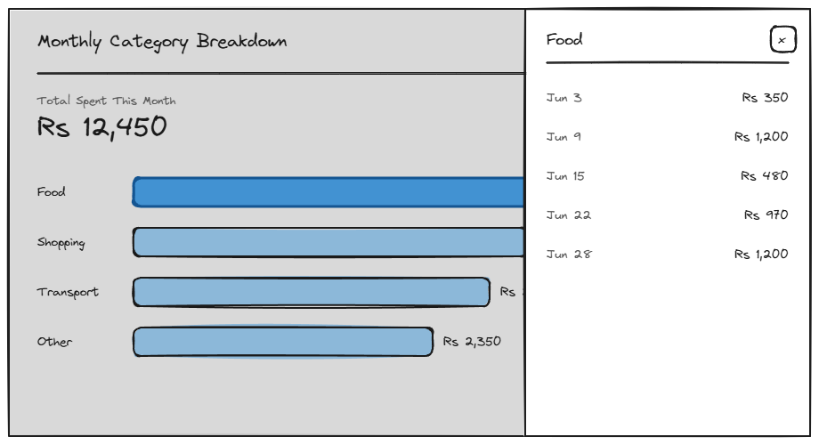

# 2.2-monthly-breakdown

## Page Metadata

| Property | Value |
|----------|-------|
| **Scenario** | 02-siddi-reviews-the-month |
| **Page Number** | 2.2 |
| **Platform** | Desktop or mobile — equal priority |

## Overview

**Page Purpose:** Spot-check a category total against memory, confirming the number is trustworthy.

**Entry Context:** Arrived from 2.1-monthly-breakdown — Siddi scanned the totals and picked one or two categories to check.

**Exit Action:** Final — scenario success ✓ (Siddi confirms the number and closes the app, feeling has become confirmed fact)

**On-Page Interactions:**
- Tapping a category bar on 2.1 opens a modal/panel for that category — this state IS that panel

---

## Design Dialog Findings

**Primary Action (D1):** Tap a category (from the 2.1 chart) to see that category's underlying list of individual transactions, comparing it against memory to verify the total isn't a bug.

**Simplification (D2):** This is a drill-down state of 2.1, not a separate page — a modal/expandable panel slides in over the 2.1 chart on tap, rather than navigating to a full "Category Detail" page. Matches how Scenario 01's 1.2/1.3 turned out to be states of 1.1, not distinct pages.

**Content Needs:**
- Modal/panel triggered by tapping a category bar on 2.1
- Panel shows: category name + list of that category's transactions (date + amount), read-only
- Close action to dismiss and return to the 2.1 chart

**Driving Forces Addressed:**
- ✅ Worry resolved: seeing the actual line items lets Siddi confirm the total against his own memory, directly answering "is it a bug, or did I really spend that much"
- ✅ Hope: this is where the "specific, trustworthy number" gets proven, not just displayed

**Complexity Notes:**
- **Second use of the modal/popup pattern this project** (first was 1.2's confirm popup) — worth tracking as a recurring pattern for the design system once a third instance appears
- This instance is simpler than 1.2's: read-only, no inline edit, no Confirm/Cancel actions — just a list + close
- Interaction model differs from 1.2: entry point is tapping a chart bar, not a form submit

---

## Visual Reference



**Wireframe:** `Sketches/2.2-monthly-breakdown-wireframe.excalidraw` (editable source) — approved 2026-07-02

**Layout:** Same 2.1 desktop chart, dimmed underneath, with the tapped category bar ("Food") highlighted. A right-side drawer panel shows:
- Category name + close (×) button
- Read-only transaction list (date + amount) for that category

---

## Layout Structure

```
+---------------------------------------------------------+
| (dimmed 2.1 chart behind)      +----------------------+ |
|                                 | Food             [x]| |
|                                 |----------------------| |
|                                 | Jun 28     Rs 1,200 | |
|                                 | Jun 22       Rs 970 | |
|                                 | Jun 15       Rs 480 | |
|                                 | Jun 9      Rs 1,200 | |
|                                 | Jun 3        Rs 350 | |
|                                 +----------------------+ |
+---------------------------------------------------------+
```

---

## Responsive Diff — Mobile (`bp-mobile`, 375px reference)

The right-side drawer doesn't fit a 375px viewport, so on mobile `breakdown-drilldown-panel` becomes a **full-screen sheet** that slides up over the entire 2.1 chart (rather than a partial-width drawer beside it) — same title, close button, and read-only transaction list, just full-bleed instead of a fixed-width panel.

```
+-------------------------------+
| Food                      [x] |
|--------------------------------|
| Jun 28              Rs 1,200  |
| Jun 22                Rs 970  |
| Jun 15                Rs 480  |
| Jun 9               Rs 1,200  |
| Jun 3                 Rs 350  |
+-------------------------------+
```

| Property | Desktop | Mobile |
|----------|---------|--------|
| Component | Drawer panel, right-side, fixed width | Full-screen sheet, slides up from bottom |
| Panel padding | `space-lg` | `space-md` |
| Dimmed 2.1 chart visible behind | Yes (partial width) | No — sheet covers the full viewport |

`breakdown-drilldown-panel`, `breakdown-drilldown-title`, `breakdown-drilldown-close`, and `breakdown-drilldown-row` Object IDs, content, and behavior (including most-recent-first sort) are unchanged — this is a container/placement diff only.

---

## Spacing

**Scale:** [Spacing Scale](../../../D-Design-System/00-design-system.md#spacing-scale)

| Property | Token |
|----------|-------|
| Panel padding | space-lg |
| Panel header to list gap | space-md |
| Transaction row gap | space-sm |

---

## Typography

**Scale:** [Type Scale](../../../D-Design-System/00-design-system.md#type-scale)

| Element | Semantic | Size | Weight | Typeface |
|---------|----------|------|--------|----------|
| Category name (panel title) | H2 | text-lg | semibold | default |
| Transaction date | p | text-sm | normal | default, muted color |
| Transaction amount | p | text-sm | normal | default |

---

## Page Sections

### Section: Drill-Down Panel

**OBJECT ID:** `breakdown-drilldown-panel`

| Property | Value |
|----------|-------|
| Purpose | Read-only proof of the category total — the line items behind the number |
| Component | [Overlay — Drawer / Sheet variant](../../../D-Design-System/00-design-system.md#overlay) |
| Padding | space-lg |
| Element gap | space-md |

---

#### Panel Title

**OBJECT ID:** `breakdown-drilldown-title`

| Property | Value |
|----------|-------|
| Component | H2 heading |
| Content | `{category}` — e.g. "Food" |

#### Close Button

**OBJECT ID:** `breakdown-drilldown-close`

| Property | Value |
|----------|-------|
| Component | Icon button (×) |
| Behavior | Dismisses the panel, returns focus to the 2.1 chart |

#### Transaction Row (repeating)

**OBJECT ID:** `breakdown-drilldown-row`

| Property | Value |
|----------|-------|
| Component | List item, read-only |
| Content | `{date}` · `{amount}` |
| Behavior | None — display only, per the decision to keep this panel read-only. List is sorted chronologically, **most recent first** — matches Home's Recent Entries convention. |

---

## Page States

| State | When | Appearance | Actions |
|-------|------|------------|---------|
| Default | Category has transactions this month | Panel open, transaction list populated | Close |
| Loading | Transaction list fetching | Panel opens with skeleton rows | None until loaded |
| Empty | Category total exists but somehow has no line items | Shouldn't normally occur — see Open Questions | Close |
| Error | List fails to load | Inline error + Retry inside the panel | Retry, Close |

---

## Technical Notes

- This panel is read-only by design decision — no edit/delete here, even though Home (1.1/1.3) supports correcting entries. If Siddi needs to fix something he spots during a spot-check, he'd need to go back to Home to do it — confirmed as staying that way, not a gap to close later.
- Transaction rows sorted `{date}` descending (most recent first).

---

## Open Questions

| # | Question | Context | Status |
|---|----------|---------|--------|
| 1 | Should the panel link/deep-link back to Home to edit a transaction he spots as wrong? | Currently read-only with no path to fix what's found here | 🟢 Resolved: no — stays read-only for v1, confirms the existing Technical Notes decision |
| 2 | Mobile layout for this panel | Right-side drawer assumes desktop screen width — mobile equivalent (full-screen sheet?) not yet explored | 🟢 Resolved — see Responsive Diff below |
| 3 | Transaction list sort order | Chronological (as drafted) vs. largest-first? | 🟢 Resolved: chronological, most recent first |

---

## Checklist

- [x] Page purpose clear
- [x] All Object IDs assigned
- [x] Components reference design system — `breakdown-drilldown-panel` uses the [Overlay — Drawer / Sheet variant](../../../D-Design-System/00-design-system.md#overlay)
- [x] Translations complete (EN only)
- [x] States documented
- [x] Conditional sections included where needed
