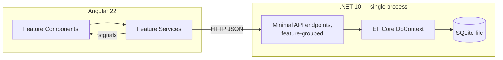
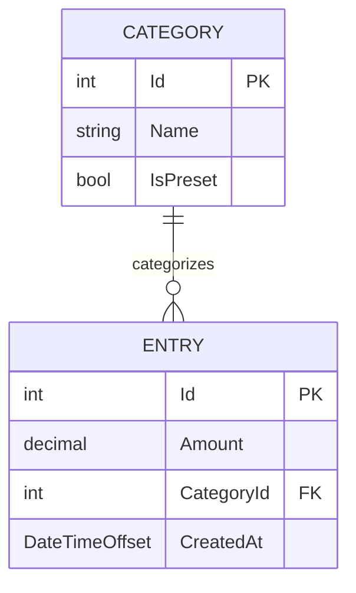
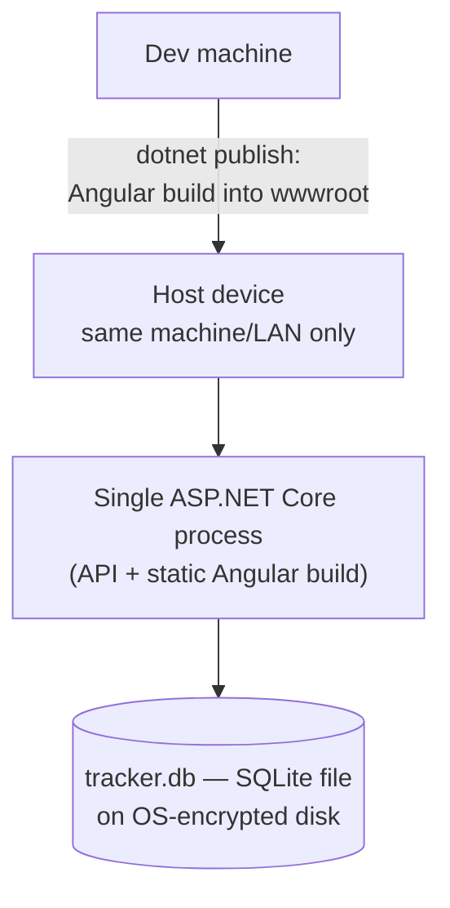

# Architecture Spine — Tracker v1

## Design Paradigm

**Minimal APIs, feature-grouped, direct-to-EF-Core.** No Controller/Service/Repository layers. Each backend feature (Entries, Categories) is a folder of endpoint-mapping files that talk to the `DbContext` directly. The Angular frontend mirrors this: one feature module per screen (Home/Log, Monthly Breakdown), each with a plain injectable service calling the API and exposing state via signals — no store, no reducers.



## Invariants & Rules

### AD-1 — No Repository/Service abstraction layer

- **Binds:** all backend endpoints (Entries, Categories)
- **Prevents:** ceremony (an interface + class per entity) with no second-implementation payoff at this scale; two builders inventing incompatible service/repository shapes
- **Rule:** Minimal API endpoint handlers call the EF Core `DbContext` directly. No `IRepository`, no `Service` interface layer. Files are grouped by feature (`Entries/`, `Categories/`), never by technical layer.

### AD-2 — Server computes, client displays — scoped to the Monthly Breakdown query, not entry mutations

- **Binds:** FR-8 (monthly breakdown); supersedes FR-7's PRD text (see Deferred)
- **Prevents:** client-side floating-point summation drifting from the exact number the PRD requires; building a total-on-every-mutation contract the finalized UX doesn't use
- **Rule:** Totals are never computed client-side. Entry add/edit/delete responses return only the affected entry — no total, per Phase 4 UX (1.3-home) moving the running total off Home entirely (a toast confirms the save instead). The Monthly Breakdown total and per-category sums are computed server-side by a dedicated month-summary query, called on page load and month-switch, never derived from entries already held client-side. Money is `decimal` end-to-end (C# `decimal`; SQLite via EF Core's decimal handling) — never `float`/`double`.

### AD-3 — Categories are data, not an enum — and v1 allows creating new ones

- **Binds:** FR-2, category storage and creation
- **Prevents:** two builders diverging on whether the category list is fixed or open; a hardcoded enum blocking the category-creation flow this spine commits to; two independent implementations of the same match-or-create dedup rule
- **Rule:** `Category` is a DB table (`Id`, `Name`, `IsPreset`), seeded with the four presets (Food, Transport, Shopping, Other) flagged `IsPreset = true`. Entry creation accepts either an existing `CategoryId` or a new category `Name`. The match-or-create logic (case-insensitive dedup against all existing names, then create if no match) is a single function owned by `Categories/`, called by the `Entries/` endpoint on entry creation — not reimplemented inline in Entries (mirrors the existing UX prototype's `isNewCategory` behavior).
- **`[OVERRIDE]`** This contradicts PRD FR-2 ("fixed set... no free text... no catch-all") and the Out-of-Scope list's "category management" exclusion. Flagged for the user to reconcile the PRD text alongside this spine — see Deferred.

### AD-4 — Single process, LAN-only, no auth gate

- **Binds:** deployment topology, NFR security/data-handling
- **Prevents:** CORS configuration, two processes/ports to run, or building an internet-facing auth story nobody asked for
- **Rule:** One ASP.NET Core process serves the API and the Angular production build (published into `wwwroot`) on a single port, reachable only on the local machine/network — no public ingress, no TLS-for-the-internet cert story. No login wall; the trust boundary is physical/network access to the host device.
- **`[OVERRIDE]`** "Local network" (any device on the home LAN, not just one physical machine) is broader than the PRD's no-auth override, which is explicitly conditioned on a *single trusted device* and calls for revisiting if the deployment model moves off that. Flagged for the user to reconcile the PRD's NFR text — see Deferred.
- **Caveat:** Encryption-at-rest is discharged via the host's OS-level full-disk encryption (Windows BitLocker on Pro/Enterprise, or the conditional "Device Encryption" on Home editions with 24H2+/modern hardware; FileVault on macOS), not application-level DB encryption (no SQLCipher, which would reopen the key-storage problem the no-auth decision sidesteps) — but this is only as good as whether the host actually has it turned on and available for its edition. See Deferred.

### AD-5 — Month-scoped queries: summary and category drill-down

- **Binds:** FR-8, Monthly Breakdown (2.1) and its drill-down panel (2.2)
- **Prevents:** two builders inventing different query shapes for "browse past months" and "show me the line items behind this category total"
- **Rule:** Backend exposes (a) a month-summary endpoint parameterized by month (total + per-category sums for that month), with the earliest-navigable month derived from `MIN(Entry.CreatedAt)` — not a configured limit — and (b) an entries-by-month-and-category endpoint, sorted `CreatedAt` descending, backing the read-only drill-down panel (2.2). The drill-down panel has no edit/delete — corrections happen only on Home, by explicit UX decision. `CreatedAt` is immutable — editing an entry (FR-6) changes `Amount`/`CategoryId` only, never `CreatedAt` — since both the month bucketing and the earliest-navigable-month floor depend on it never shifting after creation.
- **Caveat:** EF Core's SQLite provider cannot translate `Sum`/`GroupBy` over `decimal` (or reliably order by `DateTimeOffset`) to SQL. Both queries fetch the month's entries via a `WHERE`-filtered (month-bounded, small-volume) query, then sum/group/sort in-process using C# `decimal` (LINQ-to-Objects) — still exact, still never client-side, just not SQL-aggregated. Trivial cost at this data volume.
- **`[OVERRIDE]`** This contradicts PRD FR-8 ("no drill-down required") and the Out-of-Scope list's "charts, trends, or visualizations beyond the plain per-category sums." Not arbitrary: the PRD-stage `reconcile-ux-scenarios.md` already flagged Scenario 02's "distrusting a number that looks wrong" fear as real and unaddressed; Phase 4 UX (2.1/2.2) resolved it with the bar chart + drill-down, and this spine follows the resolved UX. Flagged for the user to reconcile PRD FR-8/Out-of-Scope alongside FR-7 and categories — see Deferred.

## Consistency Conventions

| Concern | Convention |
| --- | --- |
| Naming (entities, files, endpoints) | PascalCase C# types (`Entry`, `Category`); endpoint files grouped per feature folder, named for the resource (`Entries/EntriesEndpoints.cs`). Angular: one feature folder per screen, `kebab-case` file names, signal-based services named `*.service.ts`. |
| Data & formats (ids, dates, money, errors) | `Id`: integer autoincrement primary key (SQLite `INTEGER PRIMARY KEY`) — no GUIDs, single-writer local app has no distributed-id need. Dates: UTC `DateTimeOffset`, serialized ISO-8601, immutable after creation (AD-5). Money: `decimal`, never float/double, at every layer. Deletes are hard deletes — no `IsDeleted`/soft-delete column anywhere. Every Entry API response nests a `category: { id, name }` object — never a flat `categoryName` string or bare `categoryId` alone. Errors: a `ProblemDetails`-shaped JSON error envelope (RFC 9457 style) for all non-2xx responses. |
| State & cross-cutting (mutation, auth, config) | All writes (add/edit/delete) are synchronous request/response — client waits for the server's response before updating its view; no optimistic client-side mutation, no client-derived totals (AD-2). No auth middleware (AD-4). Config via `appsettings.json` (SQLite file path only meaningful setting). Schema managed via EF Core Migrations (not `EnsureCreated()`), including a seed migration for the four preset categories. |
| Responsive breakpoint | Single-tier: `bp-mobile` up to 639px, `bp-desktop` 640px+ (no tablet tier), per Design System. One shared breakpoint constant/media query — never a per-feature hardcoded pivot width. Governs the Overlay Drawer(desktop)/Sheet(mobile) switch specifically. |
| Shared UI components | Overlay (modal/drawer/sheet) is decided as a shared component from day one — built once in `client/src/app/shared/components/`, used by both Home's confirm popup and Breakdown's drill-down panel from the start. Not left for either builder to independently discover and "promote" later. |
| Async state contract | Every feature service exposes Default/Loading/Error signal state for its data, matching the Default/Loading/Empty/Error page-state tables already specified per-page (Home, 2.1, 2.2) — a consistent shape, not one invented per feature. |

## Stack

| Name | Version |
| --- | --- |
| .NET | 10 (LTS) |
| ASP.NET Core Minimal APIs | 10 |
| Entity Framework Core | latest compatible with .NET 10 — pin exact version at build time |
| SQLite (via `Microsoft.Data.Sqlite` / EF Core Sqlite provider) | latest EF Core Sqlite provider compatible with EF Core version above |
| Angular | 22 |
| Angular signals | built-in (Angular 22 core) — no NgRx |

## Structural Seed





```text
tracker/
  server/                     # ASP.NET Core project
    Entries/                  # feature: entry CRUD + month-summary + drill-down endpoints (AD-5)
    Categories/                # feature: category lookup/creation endpoints
    Data/                     # DbContext, migrations
    wwwroot/                  # Angular production build output (published here)
    Program.cs                # Minimal API host, single process entrypoint
  client/                     # Angular project (source; builds into server/wwwroot)
    src/app/
      home/                   # FR-1–FR-6, FR-9: quick-add, entry list, edit/delete, save-toast (no total — moved to monthly-breakdown, AD-2)
      monthly-breakdown/       # FR-8: total + category bar chart, month nav, drill-down panel (AD-2, AD-5)
      shared/
        components/           # reusable UI (Overlay, promoted on 2nd use)
        api/                  # feature API services, models
  tracker.db                  # SQLite file (runtime, not committed)
```

## Capability → Architecture Map

| Capability / Area | Lives in | Governed by |
| --- | --- | --- |
| FR-1, FR-3, FR-5, FR-6 (quick-add, save+confirm toast, edit, delete) | `server/Entries/`, `client/src/app/home/` | AD-1 |
| FR-2 (category selection + creation) | `server/Categories/`, `client/src/app/home/` | AD-3 |
| FR-4 (entry list with timestamp) | `server/Entries/`, `client/src/app/home/` | Structural Seed (ERD) |
| FR-7 (running total) — relocated to Monthly Breakdown per Phase 4 UX | `server/Entries/`, `client/src/app/monthly-breakdown/` | AD-2 (see Deferred: PRD text stale) |
| FR-8 (monthly breakdown, month nav, category drill-down) | `server/Entries/`, `client/src/app/monthly-breakdown/` | AD-2, AD-5 |
| FR-9 (direct wall-free entry) | `Program.cs` (routing), `client/src/app/` (default route) | AD-4 |
| FR-10 (responsive web, single deployable) | whole app | AD-4, Stack, Consistency Conventions (breakpoint) |

## Deferred

- **PRD/spine divergence on categories (AD-3).** This spine commits to user-created categories in v1; the PRD's FR-2 and Out-of-Scope list currently say otherwise. Needs a PRD amendment (or an explicit decision to revert the architecture to a fixed enum) before story-writing — don't let both documents stand as-is.
- **PRD/UX divergence on FR-7's running total (AD-2).** The PRD text still says the running total is "visible on Home." Phase 4 UX (1.3-home) already moved it to Monthly Breakdown only, and this spine follows the UX. Needs a PRD amendment to FR-7 so the PRD and the finalized UX/architecture agree — the UX is the more granular, already-validated source on this specific point.
- **PRD/UX divergence on FR-8's drill-down (AD-5).** The PRD's FR-8 says "no drill-down required" and Out-of-Scope excludes charts/visualizations beyond plain sums. The PRD-stage `reconcile-ux-scenarios.md` had already flagged the "distrusting a number" fear this leaves unaddressed; Phase 4 UX (2.1/2.2) resolved it with a bar chart + category drill-down panel, which this spine follows. Needs a PRD amendment to FR-8/Out-of-Scope alongside the FR-7 and categories amendments — three PRD points now trail the finalized UX.
- **PRD/spine divergence on the no-auth trust boundary (AD-4).** The PRD's no-auth override is conditioned on a single trusted device; this spine scopes reachability to the whole local network instead, per the user's explicit choice during this session. Needs a PRD NFR amendment acknowledging the wider boundary, or a decision to narrow the architecture back to single-device-only.
- **Encryption-at-rest is unverified (AD-4).** Discharged via OS-level full-disk encryption, but nothing confirms the host machine actually has it enabled (e.g. BitLocker isn't on by default on non-Pro Windows editions). Before treating the "encrypted at rest" NFR as satisfied, the user needs to confirm/enable disk encryption on the real host — this is an operational checklist item, not something the architecture can enforce.
- **Entry timestamp display format** (PRD's own flagged assumption, FR-4) — exact list/spot-check formatting is a UI-copy decision, not an architectural one; left to design/build.
- **Past-dated entry, CSV export, reminders, category edit/delete/reorder** — all PRD Candidate Fast-Follows, explicitly not built in v1; no architecture accommodation beyond AD-3 already keeping categories in a table rather than an enum.
- **Automated test framework/strategy** — not specified by the PRD; not fixed here given the weekend-scale scope. Pick pragmatically during build (e.g. xUnit for the API, nothing exotic) — no two-builder divergence risk serious enough to fix in the spine.
- **Backup/restore mechanics beyond "copy the file"** — no automation decided; acceptable given single-user, single-device scope.
