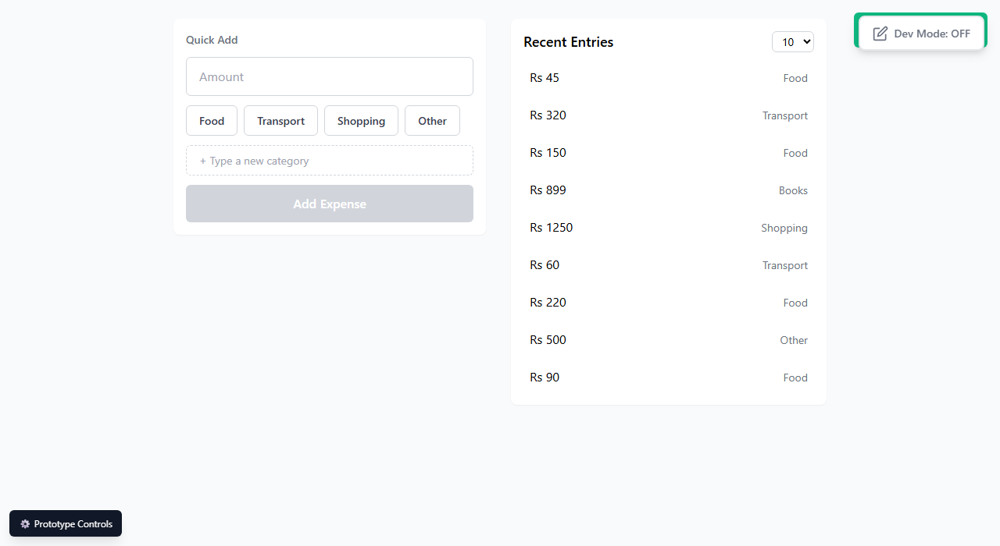

# Issue: Toast text fails WCAG AA contrast

**ID:** ISS-001
**Severity:** High
**Status:** Closed (2026-07-03)
**Delivery:** DD-001
**Test:** TS-001, accessibility_tests → color_contrast

## Resolution

Changed `success.500` token from `#10b981` to `#047857` in `1.1-home.html`'s Tailwind config. Retested with a live `getComputedStyle()` contrast calculation against the actual rendered toast (not just analytical math): **5.48:1**, clears the 4.5:1 requirement. Regression-checked the full happy-path save flow afterward — unaffected.

## Description

The success toast ("{amount} added to {category}") renders white text on a `success-500` (#10B981) green background. Measured contrast ratio is **2.54:1**, well below the WCAG AA minimum of 4.5:1 for normal-size text (the toast message is `text-sm`, 14px — not large text, which would only need 3:1).

## Expected

Contrast ≥ 4.5:1 per TS-001's `color_contrast` accessibility test and DD-001's non-functional acceptance criteria (tone/accessibility baked into the Design System).

## Actual

White (#FFFFFF) text on #10B981 background = 2.54:1 contrast ratio (calculated via WCAG relative-luminance formula from the exact hex values used in `1.1-home.html`'s Tailwind config).

## Impact

Users with low vision or in bright ambient light may struggle to read the toast confirmation — the one signal this project's own design decisions rely on to confirm "it registered" (per `1.3-home.md` Design Dialog Findings, the toast replaced the running-total as the confirmation signal). A contrast failure on the confirmation signal undercuts the core "trust the number" goal from the Product Brief.

## Design Reference

- `D-Design-System/00-design-system.md` → Patterns → Toast Notification
- `C-UX-Scenarios/01-siddi-logs-an-expense/1.3-home/1.3-home.md` → Typography table (toast message: text-sm, medium, "on dark/success background")
- Implementation: `1.1-home.html` Tailwind config (`success: { 500: '#10b981' }`), `components/toast.js`

## Steps to Reproduce

1. Open `1.1-home.html`
2. Log any expense (amount + category, Add Expense, Confirm)
3. Observe the green toast that appears top-right

## Screenshot

## Recommendation

Darken the toast background to a color that achieves ≥4.5:1 with white text — e.g. Tailwind's `emerald-700` (#047857) achieves ~4.6:1, or keep `success-500` and switch to dark text (`gray-900`) instead, which would comfortably exceed 4.5:1. Either approach preserves the "success/green" semantic while fixing contrast. Verify with a contrast checker before finalizing, since exact shade needs one more precision pass.
