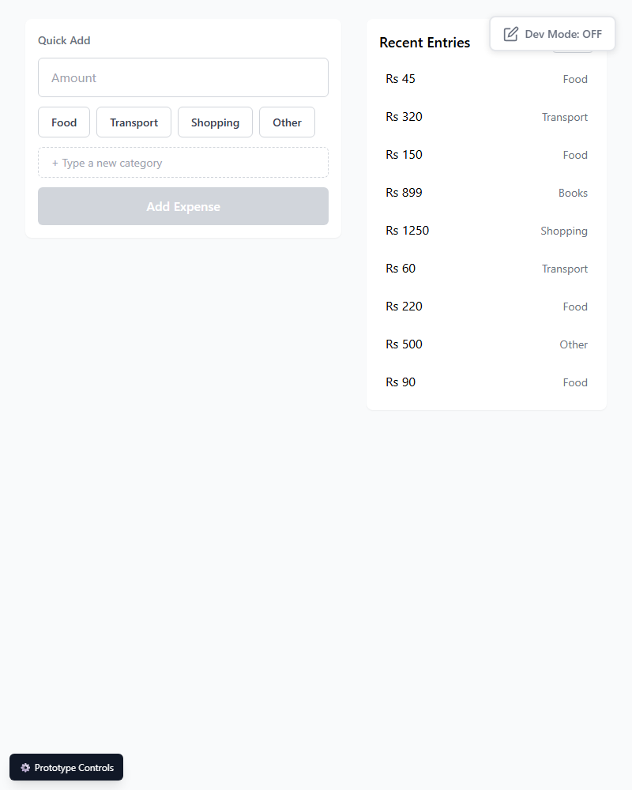

# Issue: Category buttons below minimum touch target size

**ID:** ISS-002
**Severity:** High
**Status:** Closed (2026-07-03)
**Delivery:** DD-001
**Test:** TS-001, accessibility_tests → touch_targets

## Resolution

Changed `.quick-add-category-btn` vertical padding from `py-xs` (8px) to `py-sm` (12px) in `pages/home.js`. Retested with a live `getBoundingClientRect()` measurement: **66×47px**, clears the 44×44px minimum. Regression-checked the full happy-path save flow afterward — unaffected.

## Description

The 4 preset category buttons on Home (`home-quickadd-category-{food|transport|shopping|other}`) measure **66×39px** as rendered — below the 44×44px minimum touch target size required by TS-001 (which explicitly names "category buttons" in its `touch_targets` check).

## Expected

Minimum 44×44px per TS-001 accessibility_tests and standard WCAG 2.5.5 (Target Size) guidance.

## Actual

Measured via `getBoundingClientRect()` on a live DOM instance: width 66px, **height 39px** — 5px short of the minimum height.

## Impact

On mobile, users with larger fingers or motor-control difficulty may mis-tap between adjacent category buttons — directly undercuts the "gone in a couple of taps" hope this page is designed around (per `1.1-home.md` Design Dialog Findings), since mis-taps mean re-selecting and re-confirming.

## Design Reference

- `C-UX-Scenarios/01-siddi-logs-an-expense/1.1-home/1.1-home.md` → Page Sections → Category Buttons
- `D-Design-System/00-design-system.md` → Spacing Scale (current button uses `py-xs` = 8px vertical padding, which is too little)
- Implementation: `pages/home.js` → `renderQuickAdd()`, `.quick-add-category-btn` class

## Steps to Reproduce

1. Open `1.1-home.html`
2. Inspect any of the Food/Transport/Shopping/Other buttons
3. Measure rendered height — 39px

## Screenshot

*(Screenshot shows the buttons visually; exact height was confirmed via DOM measurement, not visual estimation.)*

## Recommendation

Increase vertical padding from `py-xs` (8px) to `py-sm` (12px) on `.quick-add-category-btn`, which would add ~8px total height (39px → ~47px), clearing the 44px minimum with margin. Apply the same padding change to the "Add Expense" submit button's category-adjacent siblings for visual consistency if needed (submit button itself already measures 48px, no change needed there).
