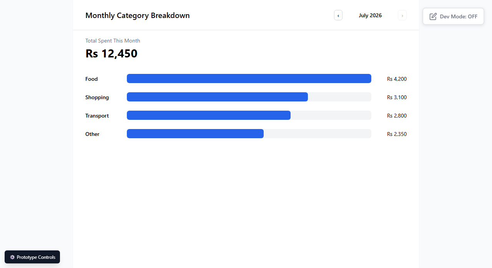

# Issue: Category bars not keyboard-accessible

**ID:** ISS-003
**Severity:** High
**Status:** Closed (2026-07-03)
**Delivery:** DD-001
**Test:** TS-001, accessibility_tests → keyboard_navigation

## Resolution

Changed `breakdown-chart-row` from `
` to `<button>` in `pages/breakdown.js` (matching the pattern already used correctly for Scenario 01's category buttons). Retested: element is now natively focusable (`tabIndex >= 0` without needing an explicit attribute), `.focus()` succeeds, and the drill-down panel still opens correctly on activation — no regression.

## Description

`breakdown-chart-row` (the clickable category bars on the Monthly Category Breakdown page that open the drill-down panel) are rendered as plain `
` elements with a `click` listener and no `tabindex`/`role`/keyboard handler — confirmed via DOM inspection (`tagName=DIV`, `tabindex=null`). They cannot be reached or activated via keyboard.

## Expected

TS-001's `keyboard_navigation` accessibility test explicitly lists "category bars" among the elements that must be "reachable via Tab, operable via Enter/Space."

## Actual

Category bars are not in the Tab order at all — keyboard-only users cannot open the drill-down panel, meaning they cannot complete the scenario's entire purpose (spot-checking a category total against memory).

## Impact

This is not a peripheral interaction — tapping a category bar to drill down IS the primary action of step 2.2, and the only way this scenario's core "worry resolved" driving force (per `2.2-monthly-breakdown.md` Design Dialog Findings) gets addressed. A keyboard-only user cannot complete Scenario 02 at all.

## Design Reference

- `C-UX-Scenarios/02-siddi-reviews-the-month/2.1-monthly-breakdown/2.1-monthly-breakdown.md` → Page Sections → Category Bar Row (`breakdown-chart-row`)
- Implementation: `pages/breakdown.js` → `renderBody()`, `.chart-row` class

## Steps to Reproduce

1. Open `2.1-monthly-breakdown.html`
2. Press Tab repeatedly from page load
3. Observe: focus moves from month-selector controls directly past the chart, never landing on a category bar

## Screenshot

*(Screenshot shows the bars visually; the keyboard-access gap isn't visible in a screenshot — confirmed via DOM attribute inspection.)*

## Recommendation

Change `breakdown-chart-row` from `
` to a semantic `<button>` (matching the pattern already used correctly for `home-quickadd-category-*` in Scenario 01), or keep the `
` but add `tabindex="0"`, `role="button"`, and a `keydown` handler for Enter/Space. The `<button>` approach is simpler and gets focus styling, keyboard activation, and screen-reader semantics for free — recommended over the ARIA-patched `
` route.
